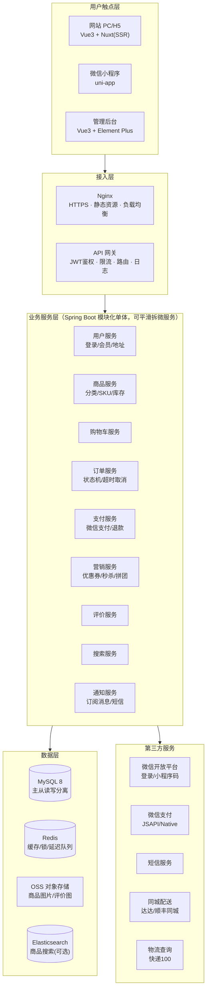
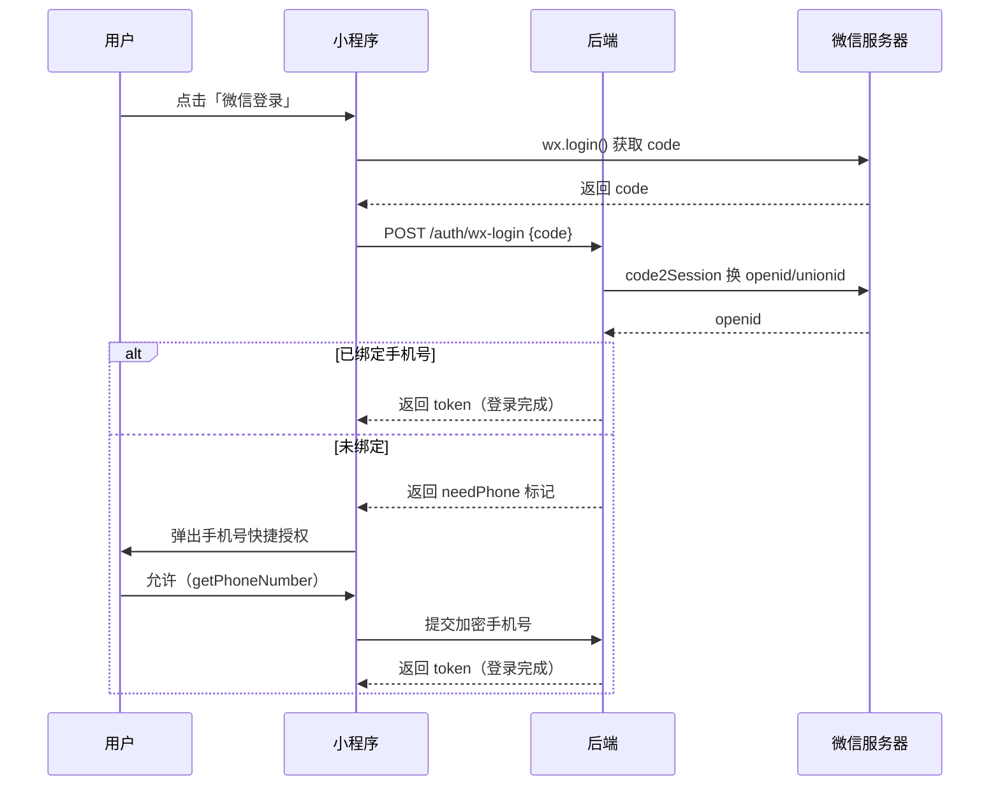
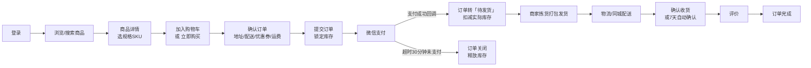
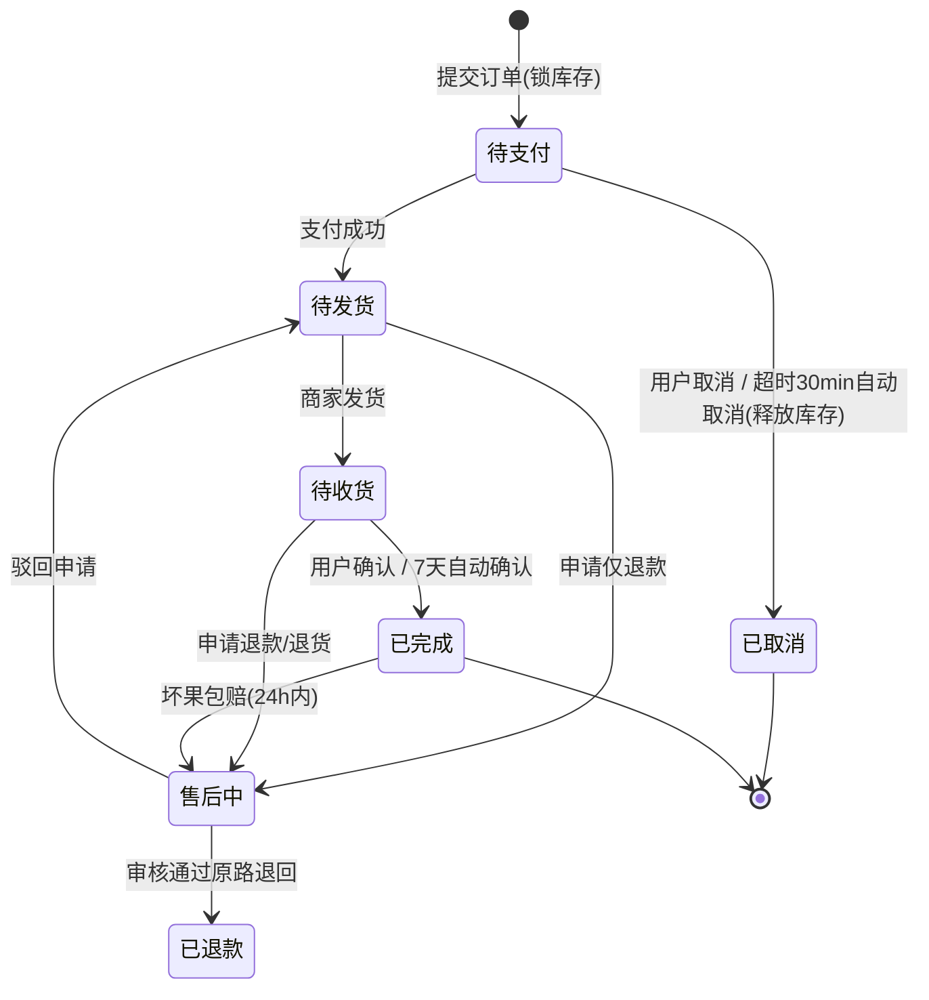
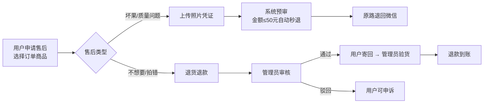

# 水果商城系统设计文档
> 网站（PC/H5） + 管理后台（Web） + 微信小程序 —— 三端一体的生鲜水果电商系统

---

## 1. 项目概述

| 端 | 定位 | 目标用户 |
|----|------|---------|
| 网站（PC/H5） | 品牌展示 + 全渠道购买，利于 SEO 拉新 | 搜索流量、老客复购 |
| 微信小程序 | 主交易入口，社交裂变、微信支付闭环 | 微信生态用户 |
| 管理后台 | 商品/订单/营销/用户/数据的一体化运营 | 商家、运营、客服、管理员 |

**三端共用一套后端 API**，数据实时同步，管理后台的任何改动（改价、上下架、优惠券）即时生效于网站与小程序。

---

## 2. 系统总体架构



架构说明：
- **前期用"模块化单体 + 前后端分离"**，一个 Spring Boot 服务按模块分包（user/product/cart/order/pay/marketing），降低运维成本；流量上来后按模块边界拆微服务。
- 网站与小程序走同一套 RESTful API，仅登录方式与支付方式不同（网站支持扫码支付 Native，小程序用 JSAPI）。
- 管理后台走独立域名与独立鉴权（RBAC），与 C 端 API 物理隔离（`/api/v1/**` 与 `/api/admin/**`）。

---

## 3. 各端功能模块设计

### 3.1 用户端（网站 + 小程序功能一致）

| 模块 | 功能点 |
|------|--------|
| 首页 | 轮播图、分类导航（时令/国产/进口/礼盒）、限时秒杀、新品推荐、热销榜 |
| 商品 | 分类列表、关键词搜索、筛选排序（价格/销量/产地）、商品详情（多规格 SKU：重量/份/等级）、产地与保质期提示 |
| 购物车 | 加购/增删改、勾选结算、失效商品自动置灰、凑单提示 |
| 订单 | 确认订单（地址/配送方式/优惠券/留言）、在线支付、订单列表与详情、物流跟踪、确认收货、取消订单 |
| 售后 | 申请仅退款（坏果包赔：拍照上传极速退款）、退货退款、售后进度查询 |
| 我的 | 个人资料、收货地址管理、我的优惠券、收藏、浏览足迹、评价中心、客服（小程序客服消息） |
| 配送 | 快递（全国）/ 同城配送（呼叫骑手）/ 门店自提，按收货地址自动匹配并计算运费 |

### 3.2 微信小程序特有

| 功能 | 说明 |
|------|------|
| 微信一键登录 | `wx.login` 换 code → 后端换 openid → 手机号快捷绑定 |
| 微信支付 | JSAPI 统一下单，支付回调驱动订单状态 |
| 订阅消息 | 发货通知、退款结果、拼团结果推送 |
| 分享裂变 | 商品海报分享、拼团邀请、分销返佣（可选） |
| 附近门店 | 门店位置、自提导航（可选） |

### 3.3 管理后台

| 模块 | 功能点 |
|------|--------|
| 数据看板 | 今日销售额/订单量/客单价、7/30天趋势、热销水果 TOP10、待处理事项（待发货/待退款） |
| 商品管理 | 分类管理（三级）、商品列表、新增/编辑（多规格 SKU、图片、产地、保质期）、库存管理、上下架、批量导入 |
| 订单管理 | 订单列表（多条件筛选）、详情、发货（快递单号/同城呼叫）、打印拣货单与面单、批量发货、修改地址、取消订单 |
| 售后管理 | 退款/退货申请审核、坏果赔付处理、退款打款 |
| 营销管理 | 优惠券（满减/折扣/新人券）、限时秒杀、拼团、轮播图与推荐位配置 |
| 用户管理 | 会员列表、消费统计、标签与分组、黑名单 |
| 内容管理 | 公告、评价审核与置顶、帮助中心 |
| 系统设置 | 管理员与角色权限（RBAC）、运费模板、配送区域、微信支付参数、操作日志 |

---

## 4. 核心业务流程

### 4.1 登录流程（小程序）



网站端：手机号 + 短信验证码登录（或账号密码），登录后签发同一体系的 JWT。

### 4.2 购物下单主流程



### 4.3 订单状态机



### 4.4 支付流程（微信支付）

1. 提交订单后，前端调用 `POST /payments/wechat/prepay`，后端以**商户订单号**调用微信「统一下单」。
2. 小程序走 JSAPI（需 openid），网站走 Native 扫码（返回二维码链接）。
3. 前端拉起支付；后端以**微信支付回调**为准变更订单状态（回调需验签 + 幂等：同一单号只处理一次）。
4. 前端支付后轮询订单状态兜底，避免掉单；每日对账单核对。

### 4.5 售后与坏果包赔流程（生鲜特色）



### 4.6 库存策略（防超卖）

- **下单锁库存**：Redis 预扣（`DECR` + Lua 判负）+ MySQL 乐观锁兜底；支付成功后扣实际库存。
- **超时释放**：订单创建即投递 Redis 延迟队列（30 分钟），到期未支付则关单释放库存。
- **秒杀场景**：活动库存单独放 Redis，请求先过队列削峰，异步落库。

### 4.7 配送流程

| 方式 | 流程 |
|------|------|
| 快递（全国） | 管理员发货录入运单号 → 调快递100订阅轨迹 → 用户端实时查看 |
| 同城配送 | 下单时按地址计算距离与运费 → 发货时呼叫达达/顺丰同城 API → 骑手接单/取货/送达状态回传 |
| 门店自提 | 下单选自提点 → 支付后生成取货码 → 门店核销 |

---

## 5. 数据库核心表设计

| 表名 | 关键字段 | 说明 |
|------|---------|------|
| `user` | id, openid, unionid, phone, nickname, avatar, level, status | 会员主表 |
| `user_address` | user_id, receiver, phone, province/city/district, detail, is_default | 收货地址 |
| `category` | id, parent_id, name, sort, icon | 分类（三级树） |
| `product` | id, category_id, name, subtitle, main_image, origin, unit, tags, status | 商品 SPU |
| `product_sku` | product_id, spec_json(如 5斤/箱), price, stock, warn_stock, image | 规格 SKU |
| `cart_item` | user_id, sku_id, quantity, checked, created_at | 购物车 |
| `order` | order_no, user_id, status, total_amount, pay_amount, freight, coupon_id, address_snapshot, delivery_type, paid_at, shipped_at | 订单主表 |
| `order_item` | order_id, product_id, sku_id, name, image, price, quantity, spec_snapshot | 订单明细（快照） |
| `payment` | order_no, transaction_id, channel, amount, status, paid_at | 支付流水 |
| `refund` | order_no, type(仅退款/退货退款), reason, images, amount, status, audit_by | 售后单 |
| `coupon` / `user_coupon` | 模板（门槛/面值/有效期）/ 领取与使用状态 | 优惠券 |
| `seckill_activity` / `pintuan_activity` | 活动商品、价格、限购、成团人数/时限 | 秒杀/拼团 |
| `review` | order_item_id, user_id, rating, content, images, status | 评价 |
| `delivery_record` | order_no, type, carrier, tracking_no, status_json | 物流/配送记录 |
| `admin_user` / `role` / `permission` | RBAC 三表 + `admin_role`、`role_permission` | 后台权限 |
| `banner` / `notice` / `operation_log` | 推荐位 / 公告 / 后台操作日志 | 内容与审计 |

设计要点：订单对商品名称/价格/图片做**快照**；金额全部用**分（int）**存储避免浮点误差；手机号加密存储。

---

## 6. 接口设计规范（示例）

统一前缀：C 端 `/api/v1`，管理端 `/api/admin`；统一响应体：

```json
{ "code": 0, "message": "ok", "data": { } }
```

| 接口 | 说明 |
|------|------|
| `POST /api/v1/auth/wx-login` | 小程序 code 登录 |
| `POST /api/v1/auth/sms-login` | 网站验证码登录 |
| `GET  /api/v1/products?categoryId=&keyword=&sort=&page=` | 商品列表 |
| `GET  /api/v1/products/{id}` | 商品详情（含 SKU） |
| `POST /api/v1/cart/items` / `GET /api/v1/cart` | 购物车 |
| `POST /api/v1/orders` | 创建订单（锁库存） |
| `POST /api/v1/payments/wechat/prepay` | 预支付（JSAPI/Native） |
| `POST /api/v1/payments/wechat/notify` | 支付回调（验签+幂等） |
| `GET  /api/v1/orders/{orderNo}/tracking` | 物流轨迹 |
| `POST /api/admin/products` / `PUT .../{id}` | 商品管理 |
| `POST /api/admin/orders/{id}/ship` | 发货 |
| `POST /api/admin/refunds/{id}/audit` | 售后审核 |

---

## 7. 技术选型建议

| 层 | 选型 | 备注 |
|----|------|------|
| 后端 | Java 17 + Spring Boot 3 + MyBatis-Plus | 生态成熟，招人容易；Node 全栈团队可换 NestJS |
| C 端网站 | Vue 3 + Nuxt 3 + TailwindCSS | SSR 利于 SEO |
| 小程序 | uni-app（Vue3 语法） | 一套代码，后期可扩 H5/App |
| 管理后台 | Vue 3 + Element Plus + Pinia | 通用中后台方案 |
| 数据库 | MySQL 8（主从）+ Redis 7 | 起步单库即可 |
| 搜索 | MySQL LIKE 起步 → Elasticsearch | 数据量大后再上 |
| 文件 | 阿里云 OSS / 腾讯云 COS | 图片走 CDN |
| 部署 | Nginx + Docker + HTTPS(Let's Encrypt) | 建议云服务器 2C4G 起步 |

---

## 8. 非功能性需求与合规

- **性能**：核心接口 P95 < 300ms；商品列表分页 + 缓存；图片懒加载 + WebP + CDN。
- **安全**：HTTPS 全站；JWT 有效期 + refresh token；支付回调验签；接口限流（网关）；手机号/地址加密存储；后台操作日志审计。
- **小程序合规（生鲜类目重点）**：
  - 需要**营业执照 + 食品经营许可证**方可上架「生鲜水果」类目；
  - 发布「时令水果」需与资质经营范围一致；
  - 价格展示规范（划线价需有依据），坏果包赔规则在详情页明示。

---

## 9. 开发迭代计划（建议）

| 阶段 | 周期 | 交付内容 |
|------|------|---------|
| M1 基础交易闭环 | 4~6 周 | 登录、商品、购物车、下单、微信支付、基础后台（商品/订单管理） |
| M2 营销与售后 | 3~4 周 | 优惠券、评价、售后退款、坏果包赔、订阅消息、物流跟踪 |
| M3 增长与效率 | 3~4 周 | 秒杀、拼团、数据看板、同城配送、打印面单、RBAC 完整权限 |
| M4 打磨上线 | 1~2 周 | 压测、对账、小程序审核提审、灰度上线 |

---

## 10. 配套交付物

- 本文档：`docs/水果商城系统设计文档.md`
- **系统框架图（可视化大图）**：`架构图/fruit-mall-architecture.html`（浏览器打开可缩放查看）
- 框架图导出 PNG：`架构图/fruit-mall-architecture.png`（可直接插入 PPT/论文）
